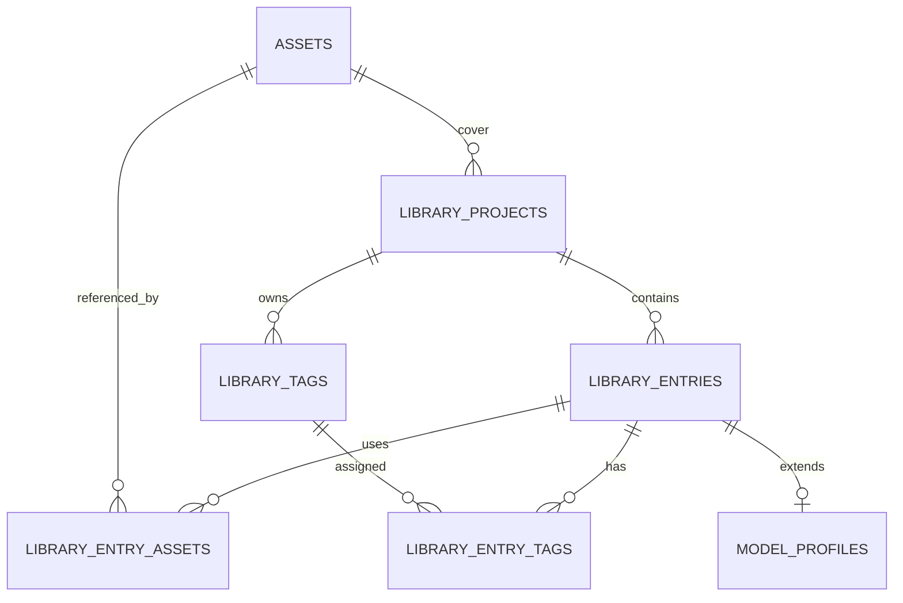

# SQLite 本地模式与 PostgreSQL 服务端模式改造计划

## 1. 文档目的

本文确定 Forart 后续数据库结构和运行方式，目标是：

- 桌面本地模式继续使用 SQLite。
- 远程服务端使用 PostgreSQL。
- 本阶段不自动兼容或导入改造前的旧数据库数据。
- 新结构建立后，本地 SQLite 使用长期、版本化的 schema migration 管理，后续版本启动时自动升级结构。
- 旧服务端数据已经由用户备份，后续需要时再通过人工导出/导入迁移。
- 本机 SQLite 旧数据可以直接丢弃，首次启动新版本时创建空数据库。
- 资源库标签继续保持当前语义：**每个资源库项目拥有独立的标签集合**。

本文是后续实施依据，不在本阶段修改业务代码或迁移现有数据。

## 2. 范围与非目标

### 本阶段范围

1. 设计一套同时支持 SQLite 和 PostgreSQL 的新数据库结构。
2. 让本地和服务端复用同一套资源库业务逻辑。
3. 通过数据库驱动配置选择 SQLite 或 PostgreSQL。
4. 新版本对空数据库执行初始化，并为本地 SQLite 建立长期 migration 链。
5. 保留 `/library` 文件目录中的图片、缩略图和画布资源存储方式。
6. 后续预留人工数据迁移脚本的接口和校验方式。

### 本阶段明确不做

- 不自动读取、修复或迁移改造前的旧版 SQLite/服务端数据库数据。
- 不在启动时兼容旧表名和旧字段。
- 不把图片二进制写入 PostgreSQL。
- 不把桌面端的 `generation-tasks.sqlite` 合并进资源库数据库。
- 不把不同资源库项目的标签合并成全局标签。
- 不要求本地 SQLite 和服务端 PostgreSQL 使用不同的业务 API。

## 3. 当前问题

当前服务端和桌面本地模式都主要依赖 `better-sqlite3`，资源库服务中直接散落着同步调用：

```js
db.prepare(sql).get(...args)
db.prepare(sql).all(...args)
db.prepare(sql).run(...args)
```

同时，模型、服装、动作资源库存在三套重复的项目/条目表。这样会带来几个问题：

- PostgreSQL 驱动是异步 API，不能只替换数据库连接字符串。
- SQLite 方言和 PostgreSQL 方言的建表、占位符、日期、事务细节不同。
- 业务服务直接依赖数据库对象，日后需要维护两套实现。
- 标签虽然当前查询包含 `kind` 和 `project_id`，但项目归属更多依赖代码约束，数据库层的约束还可以更明确。
- 初始化和历史兼容逻辑分散在服务端入口和 `library-runtime` 中。

## 4. 目标架构

```text
资源库 API / IPC
        |
统一 Repository 与业务服务
        |
数据库访问层
   +----+----+
   |         |
SQLite     PostgreSQL
本地模式   服务端模式
```

推荐使用 Kysely 作为统一数据库访问层：

```text
Kysely
├── SqliteDialect + better-sqlite3
└── PostgresDialect + pg
```

选择这一层的原因：

- 统一查询、事务和类型化表结构。
- 允许本地 SQLite 和服务端 PostgreSQL 共用 Repository。
- PostgreSQL 的异步特性可以自然传递到服务层。
- 后续可以统一管理 schema migration，而不是继续在两个入口中写 `CREATE TABLE IF NOT EXISTS`。

这意味着资源库服务需要从同步调用改成异步调用，但不需要维护两套模型、服装、动作业务代码。数据库适配差异应集中在 `server/src/db` 中。

建议目录：

```text
server/src/db/
├── database-runtime.mjs       # 根据配置创建 SQLite/PostgreSQL 实例
├── database-config.mjs        # 驱动、连接、路径配置
├── schema/
│   └── database-types.mjs     # Kysely 表类型
├── migrations/
│   ├── 001_initial_schema.mjs
│   └── migration-runner.mjs
└── repositories/
    ├── asset-repository.mjs
    ├── library-project-repository.mjs
    ├── library-entry-repository.mjs
    └── library-tag-repository.mjs
```

## 5. 数据库选择与配置

### 5.1 桌面本地模式

- 驱动：SQLite。
- 数据库文件：使用本地应用数据目录中的新数据库文件。
- 改造前的旧 SQLite 文件：本阶段不读取、不迁移，允许删除或重新生成。
- 新数据库从基线 migration 开始记录版本；从该基线之后产生的数据必须由后续 migration 保留，不能再通过删库升级。
- 适用入口：Electron 本地 API IPC。
- 图片和画布文件：继续存储在本地 `library`/`CanvasAssests` 目录。

建议配置：

```text
FORART_LIBRARY_DIR=<应用数据目录>/library
FORART_CANVAS_STORAGE_ROOT=<应用数据目录>/library
```

### 5.2 远程服务端

- 驱动：PostgreSQL。
- PostgreSQL 作为独立服务运行，不安装进 Forart Server 镜像。
- 图片和画布文件仍使用 `/library` 挂载目录。
- PostgreSQL 数据目录使用独立 Docker volume。

建议配置：

```text
PGHOST=postgres
PGPORT=5432
PGDATABASE=forart
PGUSER=forart
PGPASSWORD=<password>
FORART_LIBRARY_DIR=/library
FORART_CANVAS_STORAGE_ROOT=/library
```

数据库密码通过 `.env` 或 Docker Secret 注入，不写入仓库和镜像。

建议的 Docker 组成：

```yaml
services:
  postgres:
    image: postgres:18-alpine
    environment:
      POSTGRES_DB: forart
      POSTGRES_USER: forart
      POSTGRES_PASSWORD: ${FORART_DB_PASSWORD}
    volumes:
      - forart-postgres-data:/var/lib/postgresql

  forart-server:
    environment:
      PGHOST: postgres
      PGPORT: 5432
      PGDATABASE: forart
      PGUSER: forart
      PGPASSWORD: ${FORART_DB_PASSWORD}
    volumes:
      - ./library:/library
```

PostgreSQL 的 `5432` 不应直接暴露到公网；只有 Forart Server 需要访问数据库。

## 6. 新资源库表结构

新结构统一三类资源库的共性数据，同时用 `kind` 保持模型、服装、动作的业务隔离。

### 6.1 `library_projects`

资源库项目，例如一个模特项目、一个服装项目或一个动作项目。

| 字段 | 说明 |
| --- | --- |
| `id` | 内部 UUID/字符串主键 |
| `kind` | `model`、`outfit` 或 `action` |
| `name` | 项目名称 |
| `cover_asset_id` | 可空，封面资源外键 |
| `sort_order` | 项目排序 |
| `created_at` | 创建时间 |
| `updated_at` | 修改时间 |

约束和索引：

- `PRIMARY KEY (id)`。
- `CHECK (kind IN ('model', 'outfit', 'action'))`。
- 项目名称是否允许跨类型重复由产品规则决定；默认按 `kind + name` 做唯一约束，避免同一资源库类型出现重名项目。
- `cover_asset_id` 外键指向 `assets.id`，删除资源前必须处理封面引用。

### 6.2 `library_entries`

资源库项目中的条目。模型、服装、动作统一放在这里，通过 `project_id` 归属项目。

| 字段 | 说明 |
| --- | --- |
| `id` | 条目主键 |
| `project_id` | 所属项目外键 |
| `kind` | 与项目类型保持一致 |
| `name` | 条目名称 |
| `created_at` | 创建时间 |
| `updated_at` | 修改时间 |

关键约束：

- `FOREIGN KEY (project_id) REFERENCES library_projects(id) ON DELETE CASCADE`。
- `CHECK (kind IN ('model', 'outfit', 'action'))`。
- 通过复合外键或 Repository 校验保证 `library_entries.kind = library_projects.kind`。
- 同一项目内条目名称唯一：`UNIQUE(project_id, name)`。

### 6.3 `model_profiles`

只保存模型条目的模型特有字段，避免把服装和动作不需要的字段塞进通用表。

| 字段 | 说明 |
| --- | --- |
| `entry_id` | 同时是主键和 `library_entries.id` 外键 |
| `code` | 模特编码 |
| `gender` | 性别等模型属性，可空 |

服装和动作若未来出现特有字段，可分别增加 `outfit_profiles`、`action_profiles`，不要继续扩大通用条目表。

### 6.4 `assets`

资源文件元数据，图片二进制继续放在文件系统中。

| 字段 | 说明 |
| --- | --- |
| `id` | UUID 主键，也是内部稳定引用 |
| `storage_key` | 相对于 library 根目录的唯一存储路径 |
| `filename` | 原始或展示文件名 |
| `mime_type` | MIME 类型 |
| `width` / `height` | 图片尺寸，可空 |
| `size_bytes` | 文件大小 |
| `sha256` | 可空，内容校验值 |
| `source` | 上传、导入或生成等来源 |
| `created_at` | 创建时间 |

`storage_key` 必须唯一。业务层不再用展示文件名判断文件是否相同，也不使用可重复的目录名作为内部主键。

### 6.5 `library_entry_assets`

条目与图片资源的关系表，替代模型图片表和各类隐式图片关联。

| 字段 | 说明 |
| --- | --- |
| `entry_id` | 条目外键 |
| `asset_id` | 资源外键 |
| `role` | `primary`、`reference` 或 `gallery` |
| `caption` | 可空的说明 |
| `sort_order` | 图片顺序 |

建议主键为 `(entry_id, asset_id, role)`，并为 `asset_id` 建索引。删除条目时删除关系，不应无条件删除仍被其他条目引用的资源文件。

## 7. 标签结构和隔离规则

### 7.1 结论

是的，新表结构仍然是**每个资源库项目独立拥有标签**，不是所有项目共享一套全局标签。

例如：

```text
模特项目 A ── 标签：正面、侧面
模特项目 B ── 标签：正面、冬装
动作项目 C ── 标签：走路、转身
```

即使“正面”在 A 和 B 中名称相同，也必须是两条不同的标签记录。动作项目 C 的“转身”不能被模特项目直接使用。

### 7.2 `library_tags`

| 字段 | 说明 |
| --- | --- |
| `id` | 标签主键 |
| `library_kind` | `model`、`outfit` 或 `action` |
| `project_id` | 标签所属的唯一资源库项目 |
| `name` | 标签名称 |
| `color` | 标签颜色 token/值 |
| `sort_order` | 项目内排序 |
| `created_at` | 创建时间 |
| `updated_at` | 修改时间 |

约束：

- `FOREIGN KEY (project_id) REFERENCES library_projects(id) ON DELETE CASCADE`。
- `UNIQUE(project_id, name)`，同一项目内标签名不能重复。
- `library_kind` 必须和项目的 `kind` 一致。
- 索引：`(project_id, sort_order, name)`。

### 7.3 `library_entry_tags`

| 字段 | 说明 |
| --- | --- |
| `entry_id` | 条目外键 |
| `tag_id` | 标签外键 |
| `created_at` | 绑定时间 |

约束：

- `PRIMARY KEY (entry_id, tag_id)`。
- 条目和标签必须属于同一个 `library_projects`。
- 删除条目或标签时级联删除绑定关系。

最后一条约束很重要：不能只在前端传 `tag_id`，服务端还要验证它是否属于当前条目的项目，防止跨项目绑定标签。

### 7.4 与现有字段的对应

现有 `library_tags.kind` 可以在新结构中更名为 `library_kind`，表达它是资源库类型，而 `project_id` 表达具体隔离边界。实际实现时也可以保留字段名 `kind`，但必须统一命名和约束，避免把 `kind` 误解成条目类型或标签范围。

## 8. 关系图



## 9. 数据访问层改造方式

### 9.1 不采用的方式

不建议继续保留以下结构：

- 服务端一套 SQL，Electron 本地模式另一套 SQL。
- 每个服务直接持有 `better-sqlite3` 的 `db` 对象。
- 通过判断运行环境，在每个业务函数里分支 SQLite/PostgreSQL。
- 让 PostgreSQL 继续模拟同步 SQLite API。

这些做法会使每次字段变更都需要重复修改和测试。

### 9.2 推荐方式

1. 服务端默认使用 PostgreSQL，桌面本地模式使用 SQLite。
2. Migration runner 负责建立和升级新结构。
3. Repository 只暴露业务需要的方法，例如：

```text
listProjects(kind)
createProject(kind, input)
updateProject(projectId, input)
listEntries(projectId)
assignEntryTags(entryId, tagIds)
listProjectTags(projectId)
attachAsset(entryId, assetId, role)
```

4. 模型、服装、动作服务调用 Repository，不直接拼接数据库 SQL。
5. 所有写入在合适的 Repository 方法内使用事务。
6. 服务层统一返回现有 API 所需的数据结构，减少前端改动。

### 9.3 异步边界

PostgreSQL 使用异步查询，因此资源库服务方法统一改为 `async`。Electron IPC 调用端本身已经可以返回 Promise，调用方需要统一等待结果。

图片文件的读写仍然使用文件系统 API；数据库只记录 `asset.id` 和 `storage_key` 等元数据。不要为了适配 PostgreSQL 把图片读成 Buffer 再写入数据库。

## 10. 长期 Migration 与新库初始化

### 10.1 两类迁移必须分开

本文中的迁移分为两类：

1. **Schema migration**：管理新数据库结构从版本 N 升级到 N+1。它是应用的长期基础设施，本地 SQLite 必须从本次新结构开始持续使用。
2. **Legacy data import**：把改造前的旧 SQLite/旧服务端数据导入新结构。本阶段不做，服务端改造完成并稳定后再单独设计人工迁移工具。

不能因为本阶段放弃旧数据，就省略新结构之后的 schema migration。否则下一次修改字段时仍然只能删库。

### 10.2 通用 Schema Migration 规则

- migration 文件按递增编号执行；当前 PostgreSQL 测试阶段只保留一个包含完整当前结构的初始 migration。
- 数据库使用专门的 migration 表保存已执行的名称、执行时间和顺序。
- SQLite 和 PostgreSQL 共享 migration 的版本号与业务意图；存在方言差异时允许在同一 migration 中走经过测试的方言分支。
- 应用访问业务表之前先执行待处理 migration。
- PostgreSQL 多实例启动时使用 advisory lock，确保同一时刻只有一个实例升级结构。
- migration 只负责从本次新基线开始的结构演进，不承担改造前旧数据兼容。
- PostgreSQL 尚未正式发布，因此本阶段允许删除测试数据库并重新执行初始 migration；正式发布后恢复“已发布 migration 不可修改”的规则。
- migration 必须可重复判断当前状态，但不能依赖散落在业务入口中的临时 `ALTER TABLE` 检测。
- 自动启动只执行向前 migration，不自动执行 down migration。

### 10.3 本地 SQLite 长期迁移策略

本地 SQLite 以已发布旧资源库为唯一升级入口，当前基线为：

```text
001_legacy_library_to_current
```

本地 SQLite 的运行流程：

1. 打开数据库并启用 `PRAGMA foreign_keys = ON`。
2. 读取 migration 表，确定当前 schema 版本。
3. 如果存在待执行 migration，先关闭正在使用该库的业务请求。
4. 在升级前复制一份数据库备份，例如 `forart-library.pre-migration-<version>.sqlite`。
5. 按顺序执行 migration；能在事务中完成的升级必须使用事务。
6. 升级成功后再初始化 Repository 和本地 API。
7. 升级失败则停止打开资源库，保留原库和备份，向用户显示明确错误，不能继续使用半升级数据库。

长期规则：

- 新基线之后的本地用户数据必须保留，后续升级不允许通过删除 SQLite 文件解决。
- SQLite 不支持的复杂 `ALTER TABLE` 使用“新建临时表、复制数据、校验、替换旧表”的 migration 完成。
- 每个 migration 都要有 SQLite 集成测试，至少覆盖空库升级和上一发布版本升级。
- 发布前测试从所有仍受支持的 schema 版本逐级升级到最新版本。
- 自动备份设置保留数量上限，成功运行若干次后可清理过旧的 migration 备份，避免无限占用磁盘。

改造前的旧本地数据库不纳入这条升级链。为避免误把旧表标记成新基线，应使用新的数据库文件名，或在首次进入新版本时明确删除旧库后创建新库；不能直接给旧库写入 `001` 已完成标记。

### 10.4 PostgreSQL 结构升级与旧数据边界

新建 PostgreSQL 数据库时同样通过 migration 创建结构，并在未来服务端版本升级时继续使用 schema migration。这样服务端也不需要人工执行零散 DDL。

但是，**改造前旧服务端数据库的数据迁移不在本阶段进行**。推荐顺序是：

1. 先完成新结构和 PostgreSQL 服务端实现。
2. 使用空 PostgreSQL 数据库完成业务与压力测试。
3. 等新结构稳定后，再根据最终字段设计一次性的人工导出/导入工具。
4. 人工迁移只处理旧业务数据，不修改已经执行的 schema migration 历史。

### 10.5 首次启动行为

本地模式：

1. 创建新的 SQLite 文件。
2. 创建 migration 表并执行从 `001` 开始的全部 migration。
3. 创建默认的模型、服装、动作项目，或由现有初始化逻辑按需创建。
4. 不扫描旧 SQLite 文件，不尝试读取旧表。
5. 后续版本根据 migration 表增量执行新的结构升级，并保留新基线之后的数据。

服务端模式：

1. 连接 PostgreSQL。
2. 执行全部 migration。
3. 创建必要的默认项目或空资源库。
4. `/library` 目录只用于文件资源和画布资源，不承担数据库初始化。
5. 改造前服务端备份不在启动阶段自动导入。

## 11. Docker 部署计划

### 阶段一：空 PostgreSQL 验证

1. 增加 PostgreSQL 服务和独立 volume。
2. Forart Server 使用 `PGHOST`、`PGPORT`、`PGDATABASE`、`PGUSER`、`PGPASSWORD` 连接 PostgreSQL。
3. 启动时自动创建新表。
4. 用空数据库验证登录、资源库 CRUD、标签管理、图片上传、缩略图、画布资源访问。
5. 确认 PostgreSQL 容器重启后数据仍然存在。

### 阶段二：双模式测试

分别验证：

- Electron 本地 SQLite。
- Docker 服务端 PostgreSQL。
- 模型、服装、动作项目的创建、排序、重命名、删除。
- 项目内标签的新增、排序、改色、删除和条目绑定。
- 相同标签名称在两个项目中可以独立存在。
- 跨项目绑定标签会被服务端拒绝。
- 资源引用计数、封面引用和文件删除规则。

### 阶段三：发布切换

1. 发布包含新数据库代码的服务端镜像。
2. 先用空 PostgreSQL 环境完成健康检查。
3. 再开放服务端给客户端使用。
4. 旧数据库备份只保留作后续手动迁移，不让新服务自动读取。

## 12. 后续人工数据迁移方案

这不是本阶段工作，等 PostgreSQL 新结构和服务端功能完成并稳定后，再单独制作一次性工具。本节只针对改造前的旧服务端业务数据，不包括新结构之后的常规 schema migration。

推荐流程：

1. 从旧 SQLite 或旧服务端数据库导出 JSON，而不是直接复制数据库文件。
2. 导出项目、条目、标签、条目标签关系和资源元数据。
3. 图片文件单独复制到新的 `/library` 目录。
4. 保留已有 UUID；如果旧数据存在冲突，则生成映射表。
5. 按顺序导入：`assets`、`library_projects`、`library_entries`、特有 profile、`library_tags`、关系表。
6. 导入时验证每个 `storage_key` 对应的文件存在。
7. 导入后校验：项目数、条目数、标签数、关系数、资源数和缺失文件数。
8. 迁移失败时只删除目标 PostgreSQL 数据库并重新导入，不修改备份源。

迁移工具需要明确处理标签隔离：标签导入的唯一范围是 `project_id`，不能按标签名称全局去重。

## 13. 测试清单

### 数据库适配

- 同一组 Repository 测试分别通过 SQLite 和 PostgreSQL。
- 本地 SQLite 能从新基线的上一受支持版本逐级迁移到最新版，并保留业务数据。
- 本地 SQLite migration 失败时不会继续打开半升级数据库，升级前备份仍可恢复。
- 查询结果字段和排序一致。
- 事务失败时不会留下半条项目、标签或资源关系。
- 并发新增同名项目/标签时唯一约束生效。
- PostgreSQL 连接断开后返回可识别错误并能恢复连接。

### 标签隔离

- 同项目不能创建同名标签。
- 不同项目可以创建同名标签。
- 不同资源库类型不能互相绑定标签。
- 删除项目会删除其标签和条目绑定关系。
- 删除标签不会删除条目或图片资源。

### 文件资源

- 上传文件的 `storage_key` 不重复。
- 清理缓存不会误删仍被条目引用的文件。
- 资源库删除和画布删除不会互相误删文件。
- 数据库记录丢失时不会把展示文件名当作稳定 ID。

### 应用行为

- Electron 本地模式无网络时仍能使用 SQLite 资源库。
- 服务端模式不依赖客户端本地 SQLite 文件。
- 客户端切换服务端后标签仍按项目显示。
- 画布、任务中心和生成系统保持现有独立存储边界。

## 14. 回滚方案

### 开发和测试阶段

- 删除新建的 SQLite 文件，重新启动即可得到空库。
- 删除测试 PostgreSQL volume，重新创建空数据库。
- 资源文件目录使用独立测试目录，避免影响现有备份。

### 服务端切换阶段

- 切换回旧服务端镜像和旧数据库备份。
- 新 PostgreSQL 只作为新版本数据源，不覆盖旧备份。
- 在没有完成人工数据迁移前，不要让旧版本连接新结构数据库。

## 15. 实施顺序与验收标准

### 实施顺序

1. 建立 `server/src/db` 运行时、schema 和 migration runner。
2. 本地以 `001_legacy_library_to_current` 原地迁移旧库；PostgreSQL 保留已部署的原始 migration 历史。
3. 改造资源库 Repository 和模型/服装/动作服务为异步调用。
4. 删除分散的旧建表和历史兼容逻辑。
5. 先验收本地 SQLite 空库。
6. 接入 PostgreSQL dialect 和 Docker Compose。
7. 验收 PostgreSQL 空库。
8. 补齐双数据库集成测试和部署文档。
9. 另行开发人工导出/导入工具。

### 验收标准

- 本地模式只使用新 SQLite 数据库，旧数据不影响启动。
- 本地 SQLite 从新基线开始具备长期 migration 管理，后续结构升级不丢失已有数据。
- 服务端只使用 PostgreSQL，能够自动初始化新结构。
- 两种模式的资源库 API 行为一致。
- 标签严格按项目隔离，跨项目绑定被拒绝。
- 图片仍存储在 `/library` 文件目录，数据库只保存元数据和引用。
- 新版本不会因为旧数据库表或旧 migration 逻辑而进入兼容分支。
- 人工迁移工具可以在后续独立开发，不阻塞当前版本发布。

## 16. 当前实施与验证结果

本次已完成第一阶段实现：

- `server/src/db` 已建立 Kysely 双驱动运行时、migration provider 和统一 Repository。
- 本地继续使用 `forart-library.sqlite`；首次升级时通过单一迁移将旧资源库表原地转换为统一结构。
- 模型、服装、动作服务已复用统一的资源库实现，并统一使用异步数据库 API。
- 标签通过 `project_id + kind` 约束归属，条目标签关系使用复合外键阻止跨项目绑定。
- 服务端 Docker 配置默认使用 PostgreSQL 18，并提供 `server/docker-compose.postgres.yml`。
- 项目仍在测试阶段，新部署直接创建 PostgreSQL 18 空库，不提供旧 PostgreSQL 主版本数据卷的原地升级兼容。
- 已加入 `server/tests/library-database-smoke.mjs`，覆盖 SQLite 和 PostgreSQL 的项目、条目、图片资源、标签隔离、删除和 migration 重启检查。

已执行验证：

- SQLite 数据库 smoke test：通过。
- Docker Official Image `postgres:18-alpine`（PostgreSQL 18.6）数据库 smoke test：通过；此前 `postgres:17-alpine` 的验证记录同样通过。
- PostgreSQL 18 使用 `/var/lib/postgresql` 数据卷挂载后，容器重启的数据持久化：通过。
- PostgreSQL 18 HTTP 服务启动、管理员认证、健康检查、资源库 CRUD、图片/缩略图接口和管理统计：通过。
- 前端 TypeScript/Vite 构建与 Zod schema 校验：通过。

Docker Server 镜像构建曾因 Docker Hub 的 `node:24-bookworm-slim` 拉取授权网络错误未完成；这不影响已完成的 PostgreSQL 容器和 Node 服务端连接测试，后续网络恢复后执行 `docker compose -f server/docker-compose.postgres.yml up --build` 即可完成镜像级验证。

## 17. 最终决策摘要

| 项目 | 决策 |
| --- | --- |
| 本地数据库 | SQLite；本次新建空库，此后长期通过 schema migration 升级 |
| 服务端数据库 | PostgreSQL 18，独立 Docker 服务；测试阶段的新部署使用空库 |
| 业务代码 | SQLite/PostgreSQL 共用 Repository |
| 改造前本地数据 | 放弃，不进入新 migration 链 |
| 改造前服务端数据 | 改造完成后再设计人工导出/导入 |
| 图片存储 | 文件系统 `/library`，不放进数据库 |
| 标签范围 | 每个资源库项目独立，不做全局共享 |
| 结构迁移 | SQLite/PostgreSQL 均使用版本化 migration；本地作为长期升级机制 |
| 旧数据迁移 | 仅服务端在后续通过 JSON/文件人工导入 |
| 任务数据库 | `generation-tasks.sqlite` 继续独立，不并入本次资源库改造 |
